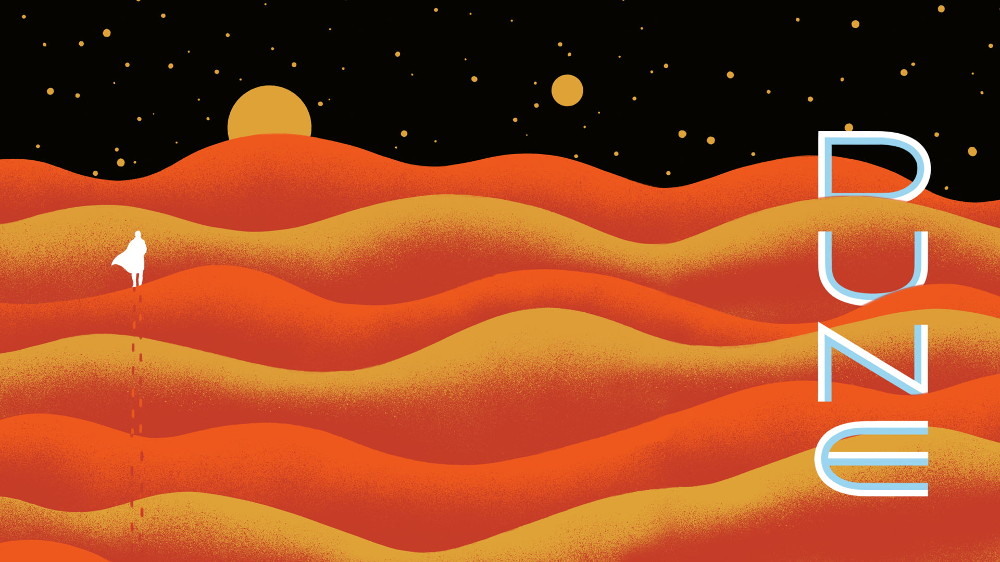

<h3 align="center">
    </br>
    Dune - colorscheme for <a href="https://github.com/neovim/neovim">(Neo)</a><a href="https://github.com/vim/vim">vim</a>
</h3>

<p align="center">
    <a href="https://github.com/ntk148v/dune.nvim/stargazers"></a>
    <a href="https://github.com/ntk148v/dune.nvim/issues"></a>
    <a href="https://github.com/ntk148v/dune.nvim/contributors"></a>
</p>

<p align="center">
Dune.nvim is extracted from a [Dune wallpaper](./dune.png).
</p>

## 1. Preview

<!-- |                                                                           |                                                                           |
| ------------------------------------------------------------------------- | ------------------------------------------------------------------------- |
|  |  |
|  |  | -->

## 2. Installation

[lazy.nvim](https://github.com/folke/lazy.nvim)
```lua
{ "ntk148v/dune.nvim", name = "dune", priority = 1000 }
```

[packer.nvim](https://github.com/wbthomason/packer.nvim)
```lua
use { "ntk148v/dune.nvim", as = "dune" }
```

[vim-plug](https://github.com/junegunn/vim-plug)
```vim
Plug 'ntk148v/dune.nvim', { 'as': 'dune' }
```

## 3. Usage

```vim
colorscheme dune
```

```lua
vim.cmd.colorscheme "dune"
```

## 4. Contribution

This colorscheme is always in development and testing. Users are welcome to use it however for programming daily. In case a user spots any bugs or error especially related to the supported plugins, treesitter or built-in LSP highlight support, then they can contribute by opening an issue or by making a pull request. More plugin highlight support is also welcome.

## 5. Credits

This colorscheme is built with [lush.nvim](http://git.io/lush.nvim); for more information on Lush and a helper script to setup your repo clone.
